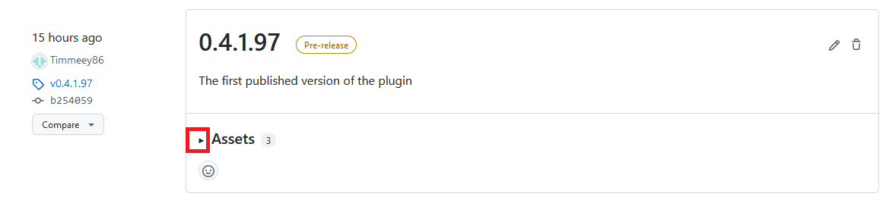

# Goal Percentage Counter (Bakkesmod Plugin for Rocket League)

This is a plugin for https://www.bakkesmod.com/index.php which gathers statistics about your success during custom training:

# Supported Use Cases

- Repeating a single shot within a custom training pack over and over again, and measuring your progress
- Repeating several different shots within a custom training pack multiple times, while tracking the overall goal percentage

# Known Limitations

- The plugin can currently only be used for training mechanics which end with you scoring the ball. For counting things like the number of flip resets you made, there are already other existing plugins.

# How to Install Manually
*Until the Bakkesmod Plugin moderators have finished source reviewing this plugin, this is the only way of installing*

1. Press the "tags" link on the right-hand side of this page (scroll to the top):
   
1. Unfold the "Assets" section on the newest tag:
   
1. Download the Plugin DLL
   
1. Save the GoalPercentageCounter.dll to `%APPDATA%\bakkesmod\bakkesmod\plugins`, or copy it there manually after downloading.
1. Start Bakkesmod and Rocket League, or, if they are already running, open the Bakkesmod Console with `F6` and type `plugin load goalpercentagecounter` there

# How to Use after Installing
1. Load into any custom training map and enjoy the plugin
1. After installing, you can always enable or disable the overlay in the Bakkesmode Settings dialog (`F2`) in the `Plugins` section
1. Statistics reset automatically when restarting the training pack or switching to another. You can also manually reset statistics in the Bakkesmod Settings dialog at any given time.

# Compiling manually

If you want to compile this yourself, you need a Visual Studio 2019 or newer, and Bakkesmod installed. It should be possible to simply clone the repo, open the solution and compile it. Note that when compiling from Visual Studio, a post-compile hook will automatically update the plugin within Bakkesmod. This even works when already in custom training.
