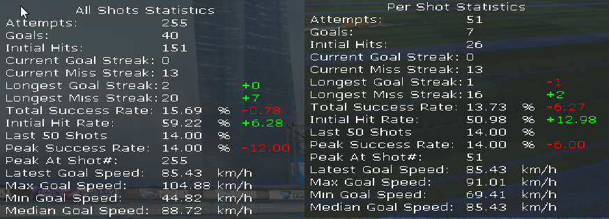

# Goal Percentage Counter (Bakkesmod Plugin for Rocket League)

This is a highly customizable plugin for https://www.bakkesmod.com/index.php which can help you train for consistency in custom training.
It does so by gathering statistics on the amount of attempts and shots you made, and displays various percentages.
It is currently developed by [Timmeey86](https://github.com/Timmeey86) and [Brandon McBride](https://github.com/BrandonMcBride4).

# Supported Use Cases

- Repeating a single shot within a custom training pack over and over again, and measuring your progress, where:
  - each shot ends with a scoring a goal
  - each shot ends with hitting the ball at least once (e.g. speed flip training packs)
- Repeating several different shots within a custom training pack multiple times, while tracking the overall goal percentage

# Core Features

- Displaying the total statistics of a longer custom training session
- Displaying separate statistics for each shot
- Customizing the overlay to make it as pleasant and as little annoying as possible for you

# Known Limitations

- The plugin can currently only be used for training mechanics which either end with you scoring a goal, or hitting the ball. For counting things like the number of flip resets you made, there are already other existing plugins.

# How to Install Manually

Note: The plug-in is much easier to install through the official Bakkesmod website:
https://bakkesplugins.com/plugins/view/302

The following guide is if you want a newer update earlier

1. Press the "tags" link on the right-hand side of this page (scroll to the top):
   
1. Unfold the "Assets" section on the newest tag:
   
1. Download the Plugin DLL
   
1. Save the GoalPercentageCounter.dll to `%APPDATA%\bakkesmod\bakkesmod\plugins`, or copy it there manually after downloading.
1. Start Bakkesmod and Rocket League, or, if they are already running, open the Bakkesmod Console with `F6` and type `plugin load goalpercentagecounter` there

# How to Use after Installing
1. Load into any custom training map and enjoy the plugin
1. After installing, you can always enable or disable the overlay in the Bakkesmode Settings dialog (`F2`) in the `Plugins` section
1. Statistics reset automatically when restarting the training pack or switching to another. You can also manually reset statistics in the Bakkesmod Settings dialog at any given time.

Note that "Peak Success Rate" is only being calculated after the 20th attempt. This is intentional in order to avoid lucky early shots affecting the peak rate too much.

# Compiling manually

If you want to compile this yourself, you need a Visual Studio 2019 or newer, and Bakkesmod installed. It should be possible to simply clone the repo, open the solution and compile it. Note that when compiling from Visual Studio, a post-compile hook will automatically update the plugin within Bakkesmod. This even works when already in custom training.
